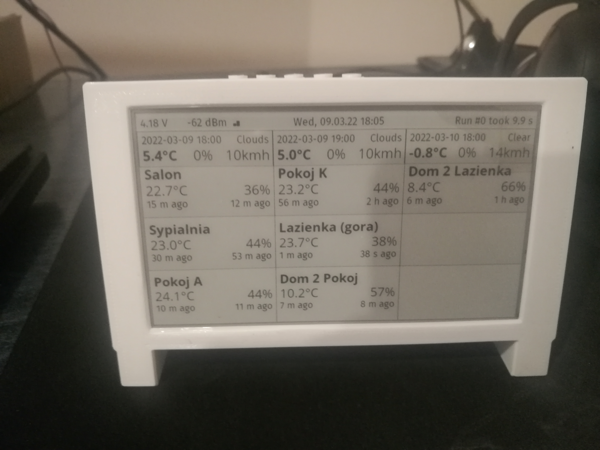

# Home Assistant and OpenWeatherMap Dashboard for LILYGO T5 4.7 inch E-paper display

Modification of project by [rbaron](https://github.com/rbaron/eink-ha) where data from Home Assistant and OpenWeatherApi is accumulated and displayed onto LilyGo T5 4.7 inch e-paper display
The 3D printed case is made by user [3DMath](https://www.thingiverse.com/thing:4890972).

Data from Home Assistant is retrieved using [REST API](https://developers.home-assistant.io/docs/api/rest/).
Data from OpenWeatherMap is 

Display is set to refresh every 20 minutes from 5am till midnight which is roughly 57 refreshes/day. Depending on the 18650 battery capacity the display can work for about 2 months (with my record being over 3 months).
## Useful Links
* [Display Hardware on Tindie](https://www.tindie.com/products/lilygo/lilygo-t5-47-inch-e-paper-esp32-v3-version/)
* [Official GitHub repo for the display](https://github.com/Xinyuan-LilyGO/LilyGo-EPD47)
  * [Display datasheet](https://github.com/Xinyuan-LilyGO/LilyGo-EPD47/blob/master/Display_datasheet.pdf)
  * [Pin definitions in code](https://github.com/Xinyuan-LilyGO/LilyGo-EPD47/blob/dc05af2a794185abf3540b6027b6ab2a13ec63c6/src/ed097oc4.h)
* Great resource at [cale-idf wiki on GitHub](https://github.com/martinberlin/cale-idf/wiki/Model-parallel-ED047TC1.h)
* [vroland/epdiy](https://github.com/vroland/epdiy): A driver library for eink displays
  * Supports our display